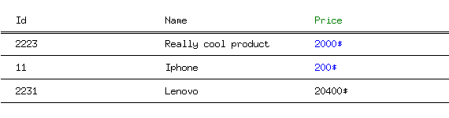

# go lang table image

Generates a table inside of a image (png or jpg format) based on the provided data

### Goals

- Provide a simple interface in order to generate tables as image programatically
- Save as png or jpg
- Ability to modify colors, multi line columns, image size optimisation
- Do not use any other 3rd party libraries, in order to provide a small bundle size

### Usage examples

- Send slack notification for bigger reports that the Slack api will send as a huge attachment
- Use in combination with a package like https://github.com/rivo/tview in order to create tables from terminal
- Add implementation that would fetch data for example from a json file and generate the image from that

### Usage

```go
package main

import (
	"tableimage"
)

func main() {
	ti := tableimage.Init("#fff", tableimage.PNG, "./test.png")

	ti.AddTH(
		tableimage.TR{
			BorderColor: "#000",
			Tds: []tableimage.TD{
				tableimage.TD{
					Color: "#000",
					Text:  "Id",
				},
				tableimage.TD{
					Color: "#000",
					Text:  "Name",
				},
				tableimage.TD{
					Color: "#008000",
					Text:  "Price",
				},
			},
		},
	)

	ti.AddTRs(
		[]tableimage.TR{
			tableimage.TR{
				BorderColor: "#000",
				Tds: []tableimage.TD{
					tableimage.TD{
						Color: "#000",
						Text:  "2223",
					},
					tableimage.TD{
						Color: "#000",
						Text:  "Really cool product on two lines",
					},
					tableimage.TD{
						Color: "#0000ff",
						Text:  "2000$",
					},
				},
			},
			tableimage.TR{
				BorderColor: "#000",
				Tds: []tableimage.TD{
					tableimage.TD{
						Color: "#000",
						Text:  "11",
					},
					tableimage.TD{
						Color: "#000",
						Text:  "A more cooler product this time on 3 lines",
					},
					tableimage.TD{
						Color: "#0000ff",
						Text:  "200$",
					},
				},
			},
			tableimage.TR{
				BorderColor: "#000",
				Tds: []tableimage.TD{
					tableimage.TD{
						Color: "#000",
						Text:  "2231",
					},
					tableimage.TD{
						Color: "#000",
						Text:  "Lenovo",
					},
					tableimage.TD{
						Color: "#000",
						Text:  "20400$",
					},
				},
			},
		},
	)
	ti.Save()
}
```

Outputs:


